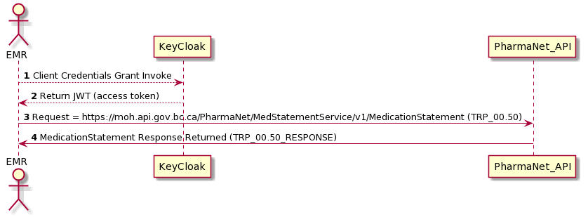

# Invoking the PharmaNet API

To access the PharmaNet interaction resources, you call and specify the resource URL corresponding to the interaction your application wishes to invoke using only HTTP POST operations when submitting HL7-v2 in a FHIR DocumentReference resource over HTTPS.

> Unlike a pure RESTful interface, all HL7-v2 interactions are submitted with HTTP POST, with the content type, or Mime-Type set as `Content-Type: application/fhir+json`, and with top-level resource type of DocumentReference as per the recommendation by HL7 when submitting HL7-v2 messages. The HL7-v2 message is added to the FHIR DocumentResource attachment as `"data"`, base64 encoded.

All PharmaNet API request use the following basic URL pattern:

```code
https://api.example.org/PharmaNet/{service-name}/{version}/{resource}
```

Where for this example URL:

- ``https://api.example.org`` is the base domain for the PharmaNet API endpoints (this is a fictitious example).
- `{version}` is the target service version, for example the initial version will be `v1`.
- `{service-name}` is the name of the microservice endpoint servicing the resource request.
- `{resource}` is the resource path, such as:
  - `MedicationRequest`, or
  - `MedicationStatement`, or
  - `Medication`

## Example Request/Response Flow



## Example Request

```code
POST https://api.example.org/PharmaNet/MedStatementService/v1/MedicationStatement/ HTTP/1.1
Content-Type: application/fhir+json
Content-Length: 147
Date: Wed, 22 Jul 2020 11:12:32 GMT
Authorization: Bearer <access_token>

{
    "resourceType": "DocumentReference",
    "masterIdentifier": {
        "system" : "urn:ietf:rfc:3986",
        "value": "urn:uuid:D8196F60-8E3F-40A6-B5C8-B5680B2C21EC"
        },
    "status" : "current",
    "date": ""2020-07030T01:09:57Z",
    "content": [{
        "attachment": {
            "contentType": "x-application/hl7-v2+er7",
            "data": "Fib3JpcyBuaXNpIHV0IGFsaXF1aXAgZXggZWEgY29tbW9yZSBkb2xvciBpbiB..."
        }
    }]
}
```

## Example Response

```code
HTTP/1.1 200 OK
Last-Modified: Wed, 22 Jul 2020 11:05:20 GMT
Date: Wed, 22 Jul 2020 11:12:33 GMT
Content-Type: application/fhir+json
Content-Length: 152
Connection: Closed


{
    "resourceType": "DocumentReference",
    "status" : "current",
    "date": ""2020-07030T01:09:58Z",
    "content": [{
        "attachment": {
            "contentType": "x-application/hl7-v2+er7",
            "data": "Fib3JpcyBuaXNpIHV0IGFsaXF1aXAgZXggZWEgY29tbW9yZSBkb2xvciBpbiB..."
        }
    }]
}
```

## Use of "Wet" Electronic Signature

An electronic signature, in the form of a binary image *must* be included in the [Prescription Record Request](../api-reference/MedicationRequest.md) Interaction.

When a 'wet' signature is required when a prescriber submits a prescription, the FHIR DocumentReference payload will include an extension containing a `signature`  for the electronic signature, specifying its mime-type as an binary image, such as `image/png` in the `sigFormat` field.

For more information, see [Electronic Signatures](electronic-signatures.md).

## HL7 FHIR DocumentReference Resource Concept

For information on an HL7 DocumentReference structure, please see [HL7 FHIR DocumentReference](https://www.hl7.org/fhir/documentreference.html)
